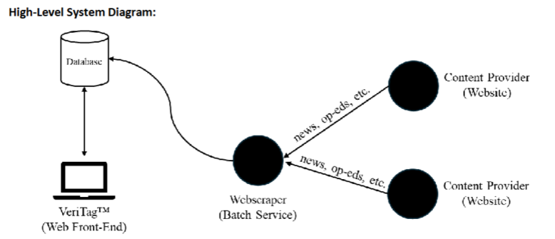

# veritag-team

This project is a web platform designed to aggregate articles from multiple sources, encourage meaningful discussions, and provide ratings to evaluate article quality and trustworthiness. It aims to create a better reading experience by integrating user feedback and verified insights.  

There are three basic types of users. Guests, regular, and verified. Verified users have special access to comment on articles trustworthiness, fact checking, and give ratings based on their expertise. These people are vetted before they get access, and have special access based on their qualifications.  Regular users login and can see the verified users comments on articles, so they can decide what to take out of said articles. If a verified user has something to say about the trustworthiness, facts, or opinions about the article, this can be taken into account from the general user perspective.  Regular users will not be able to edit in the verified comment section or provide ratings. They will have a general comment section below the article, but this is not as serious or qualified as the verified user’s contributions. Guests will only be able to see articles and ratings, but no comments and have no input themselves.

There are a few basic parts to the architecture.  The web scraper pulls content from the content providers - large media websites. The content gets pushed to the database for Veritag with all the data needed (article name, source, publisher, author, date, summary, and the article itself). It is a screen scraper algorithm that will update in a reasonable time frame to keep the articles current. It’s going to pull popular articles and a wide range of topics for people to explore. It pulls this into the Veritag database to be used there. From there, the web front end of Veritag is the actual user interface. It uses that data from the database pulled by the screen scraper and presents it on the website. So the articles are not from Veritag. But all the operations and users that are using the data are. 

Used python in various IDEs
Imported Flask framework to setup application routes to each html page
Imported Flask extension ‘session’ for user logins to keep track of individual profiles
Used SQLite Database for storing everything, website depends on this
Designed HTML Templates for web pages 
Format everything with Json files for returning structured data to the frontend (would be pulled with scraper).

To run the mai file for the website, run app.py. On app.py, you will need to have these imports from flask: Flask, render_template, redirect, url_for, request, flash, jsonify, session. Along with those, you will need to have sqlite3, json, and flask sessions all downloaded to run app.py to get the link to our web page.
To run, simply enter the link of the website. From there the top right corner will log you in to the various types of users. Hovering over an article will give you more information on it, and clicking on it will show you the whole thing with the reviews. You can click on the reviews or scroll down to see the article and the comments. Also on the main page where all the articles are, you can browse by category of article, see different users, and view your own profile.

Image of high level systems diagram is there when viewing readme in pycharm, but seems like it does not show up directly in github.
